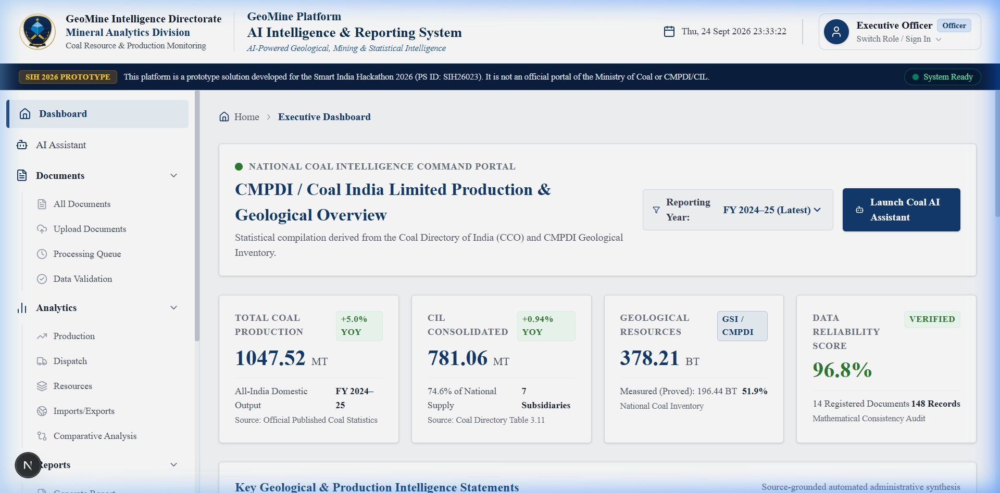
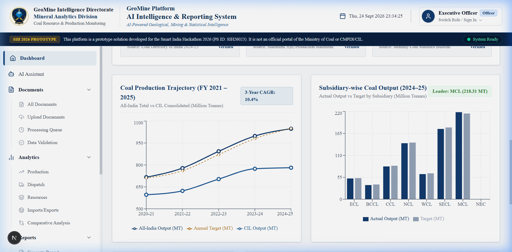
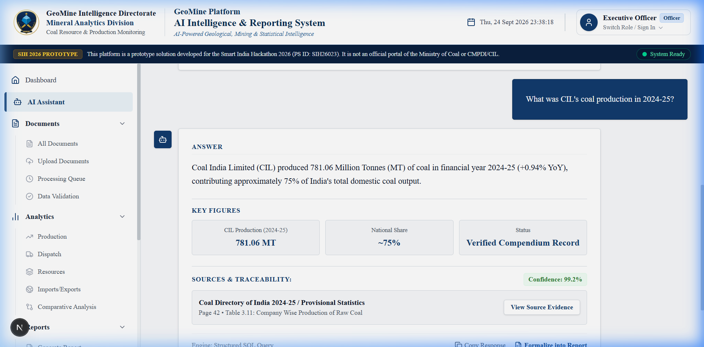
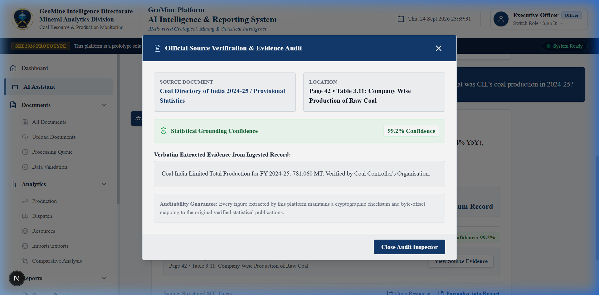
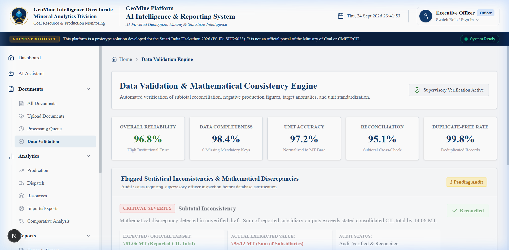
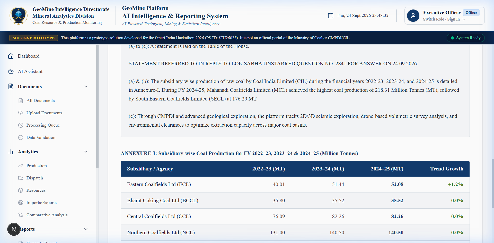
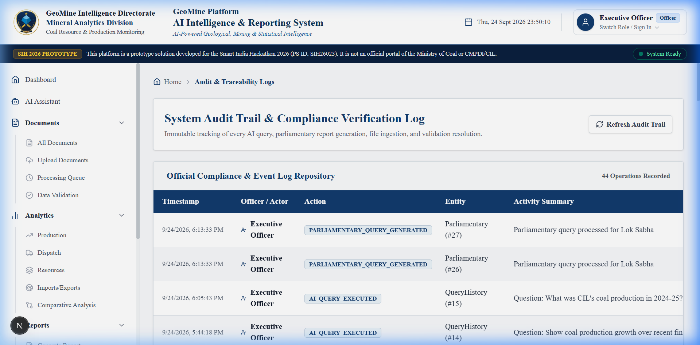

# SIH26023 — AI-Powered Geological, Mining & Reporting System

### Built for CMPDI & Coal India Limited (CIL) Subsidiaries | Smart India Hackathon 2026

[](https://www.python.org/)
[](https://fastapi.tiangolo.com/)
[](https://nextjs.org/)
[](#)

> [!IMPORTANT]
> **Prototype Disclaimer:**
> **"This platform is a prototype solution developed for the Smart India Hackathon 2026 (PS ID: SIH26023). It is not an official portal of the Ministry of Coal or CMPDI/CIL."**

---

## 💡 Why We Built This

If you look at how reporting happens today across the **Central Mine Planning & Design Institute (CMPDI)** and **Coal India Limited (CIL)**, officers face a tough operational challenge.

Every week, high-priority inquiries come in regarding national coal operations, including urgent **Parliamentary Questions (Lok Sabha & Rajya Sabha)** that require answers within hours. But the necessary data is scattered everywhere:

* 300+ page scanned PDFs of the *Coal Directory of India*
* Complex Excel sheets from 7 different operating subsidiaries (MCL, SECL, NCL, CCL, WCL, ECL, BCCL)
* Word documents containing geological block summaries
* Daily dispatch and thermal utility offtake records

Officers have to manually dig through PDFs, copy numbers into spreadsheets, recalculate totals with calculators, and draft formal ministerial replies by hand. If a subsidiary enters an outdated figure or subtotals don't add up, it can take days to trace the error.

**SIH26023** is our solution: a unified intelligence platform that reads these messy documents, cross-checks the math automatically, lets officers query data in plain English with 100% source-backed citations, and drafts official Parliamentary Gazette responses in one click.

---

## 📸 See It in Action (UI Highlights)

### 1. Executive National Coal Command Dashboard

An at-a-glance overview of national coal performance, including the historic 1,047.52 MT production milestone, CIL's 781.06 MT contribution, multi-year trajectories, and subsidiary rankings.



Multi-year production trends (FY 2021–2025) and target comparison charts:



---

### 2. Coal AI Assistant with Zero-Hallucination Source Citations

Ask any natural language question—like *"What was CIL's coal production in 2024-25?"* or *"Compare CCL, SECL, and MCL production"*. The assistant fetches the exact numbers from official tables and explains them cleanly.



Clicking **"View Source Evidence"** opens a verification modal showing the exact document name, page number, table name, and verbatim text from the ingested records:



---

### 3. Automated Data Validation & Mathematical Anomaly Engine

Catches errors before they reach executive desks. It checks whether the sum of subsidiary outputs matches the CIL consolidated total, detects negative values, and highlights discrepancies for supervisory approval.



---

### 4. 1-Click Parliamentary Gazette Generator

Need to respond to a Lok Sabha or Rajya Sabha question? Select a question or enter a query, and the system formats a formal ministerial response—including the standard parliamentary preamble, minister statement, and structured Annexure tables.



---

### 5. Audit Trail & Governance Log

Every single query, report generation, and data approval is permanently logged with timestamps and user names for complete institutional transparency.



---

## ✨ Key Capabilities

* **Grounded Answers, No Hallucinations**: Generic AI models make up numbers. Our hybrid engine translates statistical questions directly into SQL queries against verified data and cites exact page/table locations.
* **Math Consistency Checking**: Flags subtotal mismatches (e.g., when subsidiary reports sum to 795 MT while the consolidated total states 781 MT) with severity warnings and human-in-the-loop approvals.
* **Parliamentary Formats Out-of-the-Box**: Outputs formal parliamentary and ministerial gazette templates (Lok Sabha Starred/Unstarred format with structured Annexure tables).
* **Multi-Format Ingestion**: Ingests PDFs, Excel files, Word documents, and CSV logs with modular OCR support for legacy paper scans.
* **Offline / Zero-Key Fallback**: Works locally without requiring paid third-party API keys so it can run securely on internal CMPDI intranet servers.

---

## 📂 Project Structure

```
SIH26023/
├── backend/
│   ├── app/
│   │   ├── api/             # REST endpoints (auth, dashboard, documents, ai, reports, etc.)
│   │   ├── core/            # Config, database setup, JWT security
│   │   ├── models/          # SQLAlchemy database models
│   │   ├── schemas/         # Pydantic data schemas
│   │   ├── ai/              # Hybrid query engine & AI abstractions
│   │   ├── validation/      # Subtotal & math consistency engine
│   │   ├── reporting/       # PDF, Word (docx), and Excel report generators
│   │   ├── extraction/      # PDF, Excel, and CSV parsing modules
│   │   └── services/        # Business logic & audit trail logger
│   ├── data/                # Ingested datasets and generated report outputs
│   ├── scripts/             # Seed scripts & dataset ingestion
│   ├── tests/               # Pytest automated test suite
│   └── requirements.txt
├── frontend/
│   ├── app/                 # Next.js 15 app router pages
│   │   ├── ai-assistant/    # Coal AI query interface
│   │   ├── validation/      # Data anomaly & reconciliation screen
│   │   ├── reports/         # Parliamentary gazette generator
│   │   ├── documents/       # Ingestion pipeline & document viewer
│   │   ├── topics/          # Mining domain word cloud & trends
│   │   ├── catalog/         # Statistical dataset catalog
│   │   └── audit/           # System compliance audit logs
│   ├── components/          # Reusable UI cards, tables, modal dialogs
│   └── package.json
├── docs/
│   └── screenshots/         # UI preview images
├── docker-compose.yml       # Docker deployment file
├── .env.example             # Configuration template
├── .gitignore               # Clean Git ignore rules
└── README.md
```

---

## 🚀 Getting Started

Follow these simple steps to run the project locally on your machine.

### Prerequisites

Make sure you have installed:

* **Python 3.10+** ([Download Python](https://www.python.org/downloads/))
* **Node.js 18+ and npm** ([Download Node.js](https://nodejs.org/))
* Git

---

### Step 1: Clone the Repository

```bash
git clone https://github.com/Rohan302006/GeoMine-Intelligence.git
cd GeoMine-Intelligence
```

---

### Step 2: Set Up the Backend

1. **(Recommended) Create and activate a Python virtual environment**:

   ```bash
   # Windows (PowerShell):
   python -m venv venv
   .\venv\Scripts\Activate.ps1

   # Linux / macOS:
   python3 -m venv venv
   source venv/bin/activate
   ```
2. **Install backend dependencies**:

   ```bash
   pip install -r backend/requirements.txt
   ```
3. **Populate the database with baseline statistical data**:

   ```bash
   python backend/scripts/seed_database.py
   ```

   *(This creates the local database, loads official Coal Directory figures, sets up test users, and seeds realistic data validation anomalies).*
4. **(Optional) Run tests to ensure everything is solid**:

   ```bash
   python -m pytest backend/tests/ -o pythonpath=backend -v
   ```
5. **Start the FastAPI backend server**:

   ```bash
   python -m uvicorn app.main:app --app-dir backend --port 8000 --reload
   ```

   * Backend will be live at: `http://127.0.0.1:8000`
   * Interactive Swagger API Docs: `http://127.0.0.1:8000/docs`

---

### Step 3: Set Up the Frontend

Open a second terminal window in the project root:

1. **Navigate to the frontend folder**:

   ```bash
   cd frontend
   ```
2. **Install frontend dependencies**:

   ```bash
   npm install
   ```
3. **Start the Next.js development server**:

   ```bash
   npm run dev
   ```
4. **Open your browser** and visit:

   ```
   http://localhost:3000
   ```

---

## 🎯 How to Use the Website (Walkthrough Guide)

Here is a quick tour of how to navigate and demonstrate the application:

### 1. Explore the National Dashboard (`/`)

* Take a look at the **1,047.52 MT** national output, **781.06 MT** CIL production, and **378.21 BT** geological resources.
* Use the **Reporting Year** dropdown to inspect data across different financial years.
* Review the production trajectory curve and subsidiary bar chart (MCL and SECL leading production).

### 2. Query the Coal AI Assistant (`/ai-assistant`)

* Click **AI Assistant** in the sidebar.
* Click one of the quick inquiry chips (e.g. *"What was CIL's coal production in 2024-25?"*) or type a custom question.
* Inspect the answer and key metrics.
* Click **"View Source Evidence"** to see the document name, table, page number, and verification confidence score.

### 3. Review Data Anomalies (`/validation`)

* Navigate to **Data Validation**.
* Look at the **Quality Scorecard** (Overall Reliability: 96.8%).
* Check the **Flagged Inconsistencies** card pointing out a 14.06 MT subtotal mismatch between subsidiary logs and the consolidated total.
* Click **"Verify & Approve Record"** to simulate human-in-the-loop review.

### 4. Generate a Parliamentary Gazette Reply (`/reports`)

* Click **Reports** in the sidebar.
* Choose a question template (e.g., CIL subsidiary production over the last 3 years).
* Click **"Generate Official Parliamentary Response"**.
* Notice the authentic Lok Sabha Unstarred Question format, complete with the Minister of State's official response and structured Annexure tables.

### 5. Check Document Ingestion & Audit Logs (`/documents` & `/audit`)

* Visit **Documents** to see the 6-stage pipeline (Upload → OCR → Normalization → Table Extraction → Mathematical Audit → Catalog Indexing).
* Visit **Audit Trail** to see the chronological record of every query answered, report generated, and verification action taken during your session.

---

## 👥 Role-Based Access Control (RBAC) & Demo Logins

The application includes full **Role-Based Access Control (RBAC)** across the UI and FastAPI backend. You can test each tier by clicking **"Switch Role / Sign In"** in the top navigation bar or using the credentials below:

| Role | Email | Password | Permissions & System Behavior |
| :--- | :---- | :------- | :---------------------------- |
| **System Administrator** | `admin@geomine.ai` | `DemoPass#2026` | Full platform control, audit trail management, data approval & document compilation |
| **Executive Officer** | `officer@geomine.ai` | `DemoPass#2026` | AI queries, official Parliamentary & executive report drafting, and anomaly reconciliation |
| **Data Analyst** | `analyst@geomine.ai` | `DemoPass#2026` | Mathematical anomaly review, CSV/Excel document uploads & staging |
| **Public Viewer** | `viewer@geomine.ai` | `DemoPass#2026` | Read-only access to published catalogs & dashboard trajectories (restricted from generating reports or approving data) |

> **How to test RBAC:**
> 1. Click **"Switch Role / Sign In"** next to the user badge in the top navigation bar.
> 2. Use the **"1-Click Role Switcher"** tab to instantly toggle between Admin, Officer, Analyst, and Viewer.
> 3. Or use the **"Sign In with Password"** tab to test manual JWT authentication with the passwords above.
> 4. Notice how navigating to **Reports** or **Validation** while in **Viewer** mode displays RBAC restriction alerts and disables state-modifying actions.

---

## 🛠️ Technology Stack

* **Frontend**: Next.js 15 (App Router), React 19, TypeScript, Tailwind CSS, Lucide Icons, Recharts.
* **Backend**: FastAPI (Python 3.10+), SQLAlchemy 2.0, Pydantic v2, Uvicorn.
* **Database**: SQLite (default zero-config local file) / PostgreSQL (via Docker or environment variable).
* **Document Processing & Reporting**: ReportLab (PDF), python-docx (Word), openpyxl (Excel), PyPDF.
* **NLP & Analytics**: Scikit-Learn (TF-IDF vector matching), WordCloud, custom Hybrid SQL translation engine.

---

## ⚖️ Prototype Grounding & Official Disclaimer

> [!WARNING]
> **Official Notice:**
> **"This platform is a prototype solution developed for the Smart India Hackathon 2026 (PS ID: SIH26023). It is not an official portal of the Ministry of Coal or CMPDI/CIL."**
>
> This prototype demonstrates mathematical validation and RAG capabilities using publicly released statistical publications (including the *Coal Directory of India 2022-23 to 2024-25*, *Provisional Coal Statistics*, and the *Inventory of Geological Resources of Coal*). In an enterprise production deployment, the ingestion pipeline can connect directly to internal intranet document stores, SAP/ERP databases, and private document archives.

---

## 🤝 Contributing & SIH Team

Developed with ❤️ for **Smart India Hackathon 2026** to empower CMPDI and Coal India Limited with fast, trustworthy, and mathematically verified reporting.
